# facticli
[](https://github.com/aic-factcheck/facticli/actions/workflows/ci.yml)

`facticli` is a pip-installable Python CLI for agentic claim verification with OpenAI-compatible inference profiles (`openai`, `gemini`).

It restructures key ideas from `~/PhD/aic_averitec` (claim decomposition, evidence gathering, verdict synthesis) into a modular command-line multi-agent workflow with:
- open web search,
- orchestrated parallel subroutines,
- final veracity verdict + justification,
- explicit source output.

The architecture is intentionally inspired by Codex-style modular prompting: local skill prompts (`plan`, `research`, `judge`) with explicit pipeline stages and pluggable provider adapters.

## 📦 Install

From this repository:

```bash
pip install -e .
```

## ⚙️ Configure

Set your API key:

```bash
export OPENAI_API_KEY=...
```

Optional defaults:

```bash
export FACTICLI_MODEL=gpt-4.1-mini
export GEMINI_API_KEY=...
export FACTICLI_GEMINI_MODEL=gemini-3-pro
export FACTICLI_INFERENCE_PROVIDER=openai
export FACTICLI_SEARCH_PROVIDER=openai
export FACTICLI_BASE_URL=...
# only needed when FACTICLI_SEARCH_PROVIDER=brave
export BRAVE_SEARCH_API_KEY=...
```

## 🚀 Usage

Run a claim check:

```bash
facticli check "The Eiffel Tower was built in 1889 for the World's Fair."
```

Run with Brave Search API retrieval:

```bash
facticli check --search-provider brave "The Eiffel Tower was built in 1889 for the World's Fair."
```

Run with Gemini inference provider:

```bash
facticli check \
  --inference-provider gemini \
  --model gemini-3-pro \
  --search-provider brave \
  "The Eiffel Tower was built in 1889 for the World's Fair."
```

Show the generated plan:

```bash
facticli check --show-plan "The Eiffel Tower was built in 1889 for the World's Fair."
```

Stream plan and per-check progress while the run executes:

```bash
facticli check --stream-progress "The Eiffel Tower was built in 1889 for the World's Fair."
```

Enable one bounded follow-up review round before the final verdict:

```bash
facticli check --feedback-rounds 1 --follow-up-checks 2 \
  "The Eiffel Tower was built in 1889 for the World's Fair."
```

Machine-readable output:

```bash
facticli check --json --include-artifacts "The Eiffel Tower was built in 1889 for the World's Fair."
```

List built-in agent skills:

```bash
facticli skills
```

Generate an Averitec submission file from Averitec-formatted input claims:

```bash
python3 scripts/run_averitec_submission.py \
  --input data/averitec/dev.json \
  --output data/averitec/submission_generated.json \
  --inference-provider openai \
  --search-provider openai
```

Notes:
- If input rows have no claim id field, fallback `claim_id` is the zero-based row index.
- Output rows follow Averitec format: `claim_id`, `claim`, `pred_label`, `evidence`.
- `evidence` entries include `question`, `answer`, `url`, `scraped_text`.

Extract decontextualized atomic check-worthy claims from arbitrary text:

```bash
facticli extract-claims "In last year’s debate, the minister said inflation fell below 3% while wages rose 10%."
```

Extract claims from a transcript file:

```bash
facticli extract-claims --from-file ./data/debate_excerpt.txt --json
```

## 🧰 CLI options

```text
facticli check [--model MODEL] [--max-checks N] [--parallel N]
               [--feedback-rounds N] [--follow-up-checks N]
               [--inference-provider {openai,gemini,openai-agents}]
               [--base-url BASE_URL]
               [--search-provider {openai,brave}]
               [--search-results N]
               [--search-context-size {low,medium,high}]
               [--show-plan] [--stream-progress]
               [--json] [--include-artifacts]
               "<claim>"

facticli extract-claims [--from-file PATH]
                        [--inference-provider {openai,gemini,openai-agents}]
                        [--model MODEL] [--base-url BASE_URL]
                        [--max-claims N] [--json]
                        [text]
```

Validation notes:
- `--max-checks`, `--parallel`, and `--max-claims` must be integers `>= 1`.
- `--feedback-rounds` must be an integer `>= 0`.
- `--follow-up-checks` must be an integer `>= 1`.
- `--search-results` must be an integer in `1..20`.
- For `extract-claims`, provide either positional `text` or `--from-file`, but not both.

## 🧠 Current architecture

Layered runtime:
- `core`: typed contracts, normalization helpers, and run artifacts.
- `application`: provider-agnostic interfaces, explicit stages (`PlanStage`, `ResearchStage`, `ReviewStage`, `JudgeStage`, `ClaimExtractionStage`), and services.
- `adapters`: a shared OpenAI-compatible strategy implementation plus provider profile bootstrap.

Pipeline behavior:
- `plan` skill decomposes claims into independent checks.
- `research` runs per-check concurrently with bounded parallelism and retry.
- `review` optionally requests one or more targeted follow-up checks before final judgment.
- `judge` synthesizes findings into one verdict with merged deduplicated sources.
- claim extraction runs through a dedicated extraction stage/backend.

Inference backend:
- one OpenAI Agents SDK path (`Runner`, tools, structured output) for all profiles.
- provider profile only swaps API key/base URL/API mode.

### Fact-check pipeline flow

```mermaid
flowchart TD
  A["CLI: facticli check <claim>"] --> B["run_check_command<br/>validate provider/search keys<br/>build OrchestratorConfig"]
  B --> C["FactCheckOrchestrator(config)"]

  subgraph S["Service construction"]
    C --> D["build_fact_check_service"]
    D --> E["configure_openai_compatible_client"]
    E --> F["Create planner / researcher / review / judge adapters"]
    F --> G["Create PlanStage / ResearchStage / ReviewStage / JudgeStage"]
    G --> H["FactCheckService"]
  end

  H --> I["check_claim<br/>normalize claim<br/>create RunArtifacts<br/>emit run_started"]

  subgraph P["Plan stage"]
    I --> J["PlanStage.execute"]
    J --> K["CompatiblePlannerAdapter.plan"]
    K --> L["Runner.run(claim_planner)"]
    L --> M["InvestigationPlan (raw)"]
    M --> N["Normalize checks<br/>limit queries<br/>fallback direct check if empty"]
    N --> O["Store plan artifacts<br/>emit planning_completed"]
  end

  subgraph R["Research stage"]
    O --> P1["ResearchStage.execute<br/>emit research_started"]
    P1 --> P2["Create one asyncio task per check"]
    P2 --> P3["Bound concurrency with semaphore"]
    P3 --> P4["For each check: retry with timeout"]
    P4 --> P5["CompatibleResearchAdapter.research"]
    P5 --> P6["Runner.run(check_researcher)"]
    P6 --> P7{"Search provider"}
    P7 -->|openai| P8["WebSearchTool"]
    P7 -->|brave| P9["brave_web_search function tool"]
    P8 --> P10["AspectFinding"]
    P9 --> P10
    P10 --> P11{"Succeeded?"}
    P11 -->|yes| P12["Store finding<br/>emit research_check_completed"]
    P11 -->|no after retries| P13["Create insufficient finding<br/>record error<br/>emit research_check_failed"]
    P12 --> P14["Ordered findings list"]
    P13 --> P14
    P14 --> P15["emit research_completed"]
  end

  subgraph JG["Judge stage"]
    P15 --> Q{"feedback rounds enabled?"}
    Q -->|yes| Q1["ReviewStage.execute<br/>emit review_started"]
    Q1 --> Q2["CompatibleReviewAdapter.review"]
    Q2 --> Q3["Runner.run(evidence_review)"]
    Q3 --> Q4{"follow-up requested?"}
    Q4 -->|yes| Q5["Build follow-up plan<br/>retry selected checks<br/>add new targeted checks"]
    Q5 --> Q6["ResearchStage.execute for follow-up round"]
    Q6 --> Q1
    Q4 -->|no| R1["JudgeStage.execute<br/>emit judging_started"]
    Q -->|no| R1
    R1 --> R2["CompatibleJudgeAdapter.judge"]
    R2 --> R3["Runner.run(veracity_judge)"]
    R3 --> R4["FactCheckReport (raw)<br/>merge + deduplicate sources<br/>store report artifacts<br/>emit judging_completed"]
  end

  R4 --> T["Save artifacts repository (if configured)<br/>emit run_completed"]
  T --> U{"Output mode"}
  U -->|text| V["format_run_text -> stdout"]
  U -->|json| W["report JSON -> stdout<br/>optionally add plan / findings / artifacts"]
```



When `--stream-progress` is enabled, progress events are formatted in the CLI and written to `stderr` during the run. Validation failures and uncaught command errors also go to `stderr`.

`facticli extract-claims` uses a separate path: CLI -> `ClaimExtractor` -> `ClaimExtractionService` -> `ClaimExtractionStage` -> `CompatibleClaimExtractionAdapter` -> `Runner.run(...)` -> `ClaimExtractionResult`.

## 🗂️ Repository layout

```text
src/facticli/
  core/
    contracts.py     # typed plan/finding/report/extraction contracts
    normalize.py     # deterministic normalization helpers
    artifacts.py     # run artifact schemas
  application/
    interfaces.py    # planner/research/review/judge strategy contracts
    stages.py        # explicit pipeline stages
    services.py      # fact-check and extraction application services
    factory.py       # provider wiring composition root
  adapters/
    openai_provider.py # shared OpenAI-compatible stage adapters
    provider_profile.py# provider profile resolution + client bootstrap
  cli.py             # command-line interface
  orchestrator.py    # compatibility facade over application service
  claim_extraction.py# compatibility facade over extraction service
  skills.py          # skill registry + prompt loading
  types.py           # compatibility re-export for contracts
  prompts/
    extract_claims.md
    plan.md
    research.md
    judge.md
    review.md
```

## 📓 Demo notebooks

Interactive demos live in `/Users/bertik/PhD/facticli/notebooks`:

- `01_planner_subroutine_demo.ipynb`
- `02_research_subroutine_demo.ipynb`
- `03_judge_subroutine_demo.ipynb`
- `04_full_checker_demo.ipynb`
- `05_claim_extraction_demo.ipynb`
- `06_averitec_submission_workflow.ipynb`

Each notebook includes:
- auto-reload setup (`%load_ext autoreload`, `%autoreload 2`),
- emoji-based headings for quick navigation,
- multiple example claims as commented-out variable redefinitions.

## ✅ Testing

Run the integrated unit tests:

```bash
python3 -m unittest discover -s tests -p "test_*.py" -v
```

Run the standard test routine (loads `.env` if present):

```bash
./scripts/test_routine.sh
```

Run with live smoke enabled:

```bash
./scripts/test_routine.sh --live-smoke
```

Notes:
- Live smoke tests are guarded by `FACTICLI_RUN_LIVE_SMOKE=1`.
- The live smoke test currently validates the OpenAI profile path.

## 🤖 GitHub automation

This repo includes two GitHub Actions workflows:
- `.github/workflows/ci.yml`: runs on every push and pull request (compile + CLI checks + unit tests).
- `.github/workflows/live-smoke.yml`: runs live smoke tests manually (`workflow_dispatch`) and on a daily schedule.

To enable live smoke in GitHub:
1. Go to repository `Settings` -> `Secrets and variables` -> `Actions`.
2. Add secret `OPENAI_API_KEY`.
3. Optionally edit `.github/workflows/live-smoke.yml` to remove or change the schedule.

## 🤝 Contributor guide

- Project contributor/agent guidance lives in `/Users/bertik/PhD/facticli/AGENTS.md`.
- `/Users/bertik/PhD/facticli/CLAUDE.md` is a symlink to the same file.

## 📝 Notes

- This is an initial bootstrap and intentionally leaves room for deeper evaluator tooling, benchmark harnesses, and richer source quality scoring.
- If you installed in editable mode, updates in `src/` are reflected immediately.

## 📄 License

CC-BY-SA-4.0
