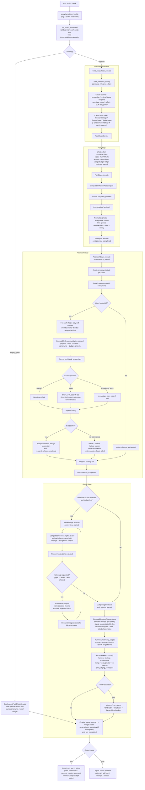

# facticli
[](https://github.com/aic-factcheck/facticli/actions/workflows/ci.yml)

Claim extractor now live at https://aic-factcheck.github.io/facticli/.

`facticli` is a pip-installable Python CLI for agentic claim verification with OpenAI-compatible inference APIs.

It restructures key ideas from `~/PhD/aic_averitec` (claim decomposition, evidence gathering, verdict synthesis) into a modular command-line multi-agent workflow with:
- open web search,
- orchestrated parallel subroutines,
- final veracity verdict + justification,
- explicit source output.

The architecture is intentionally inspired by Codex-style modular prompting: local skill prompts (`plan`, `research`, `review`, `judge`) written as lane contracts, explicit pipeline stages, and one OpenAI-compatible inference adapter path. The 2026-09 harness pass added ideas from Codex, pi, OpenClaw, and recent fact-checking research: run-level token budgets, an error taxonomy with SDK-managed retries, deterministic source tiering, acceptance-criteria-driven review, a judge that must argue the opposing verdict, per-stage model routing, a no-harness baseline, citation health checks, artifact audits, and TOML config profiles. See `TODO.md` for the annotated list.

## 📦 Install

From this repository:

```bash
pip install -e .
```

## ⚙️ Configure

Set the OpenAI-compatible endpoint, key, and model:

```bash
export OPENAI_API_BASE_URL=https://api.openai.com/v1
export OPENAI_API_KEY=...
export OPENAI_API_MODEL=gpt-5.4
```

Common base URLs:

```bash
# OpenAI
export OPENAI_API_BASE_URL=https://api.openai.com/v1
# Anthropic OpenAI SDK compatibility
# export OPENAI_API_BASE_URL=https://api.anthropic.com/v1/
# Gemini OpenAI compatibility
# export OPENAI_API_BASE_URL=https://generativelanguage.googleapis.com/v1beta/openai/
# Ollama at e-INFRA CZ
# export OPENAI_API_BASE_URL=https://llm.ai.e-infra.cz/v1
```

Optional retrieval defaults:

```bash
export FACTICLI_SEARCH_PROVIDER=openai
# only needed when FACTICLI_SEARCH_PROVIDER=brave
export BRAVE_SEARCH_API_KEY=...
```

## 🚀 Usage

Run a claim check:

```bash
facticli check "The Eiffel Tower was built in 1889 for the World's Fair."
```

Run with Brave Search API retrieval:

```bash
facticli check --search-provider brave "The Eiffel Tower was built in 1889 for the World's Fair."
```

Run with another OpenAI-compatible inference endpoint:

```bash
export OPENAI_API_BASE_URL=https://generativelanguage.googleapis.com/v1beta/openai/
export OPENAI_API_KEY=...
export OPENAI_API_MODEL=gemini-3.1-pro-preview

facticli check \
  --search-provider brave \
  "The Eiffel Tower was built in 1889 for the World's Fair."
```

Run with an Ollama-style OpenAI-compatible endpoint:

```bash
export OPENAI_API_BASE_URL=https://llm.ai.e-infra.cz/v1
export OPENAI_API_KEY=...
export OPENAI_API_MODEL=kimi-k2.5

facticli extract-claims \
  "In last year’s debate, the minister said inflation fell below 3% while wages rose 10%."
```

For full fact-check runs with third-party inference endpoints, prefer Brave search:

```bash
facticli check \
  --search-provider brave \
  "The Eiffel Tower was built in 1889 for the World's Fair."
```

Show the generated plan:

```bash
facticli check --show-plan "The Eiffel Tower was built in 1889 for the World's Fair."
```

Stream plan and per-check progress while the run executes:

```bash
facticli check --stream-progress "The Eiffel Tower was built in 1889 for the World's Fair."
```

Enable one bounded follow-up review round before the final verdict:

```bash
facticli check --feedback-rounds 1 --follow-up-checks 2 \
  "The Eiffel Tower was built in 1889 for the World's Fair."
```

Show token usage, cache hit rate, budget, and per-stage stats:

```bash
facticli check --show-usage "The Eiffel Tower was built in 1889 for the World's Fair."
```

Cap the whole run with a shared token budget (remaining checks are marked `budget_exhausted`, follow-up rounds are skipped). The budget is checked before each research check, review round, and follow-up round starts; a stage already running is never cut mid-call, so the final total can overshoot by one stage:

```bash
facticli check --token-budget 40000 --feedback-rounds 1 "The Eiffel Tower was built in 1889 for the World's Fair."
```

Route stages to different models or reasoning efforts (cheap research, frontier judge):

```bash
facticli check \
  --stage-model research=gpt-5-mini --stage-model judge=gpt-5.4 \
  --stage-effort research=low --stage-effort judge=high \
  "The Eiffel Tower was built in 1889 for the World's Fair."
```

Verify cited URLs after judging (HEAD/GET with a Wayback fallback; sources are marked `live`, `archived`, or `broken`):

```bash
facticli check --verify-sources "The Eiffel Tower was built in 1889 for the World's Fair."
```

Run the no-harness single-agent baseline (same model, tool, budget, and output contract; only the orchestration differs):

```bash
facticli check --strategy single_agent "The Eiffel Tower was built in 1889 for the World's Fair."
```

Exclude fact-checking sites from evidence (label-leakage control) and persist run artifacts for audits:

```bash
facticli check --block-fact-checkers --artifacts-dir ./runs "The Eiffel Tower was built in 1889 for the World's Fair."
```

Machine-readable output:

```bash
facticli check --json --include-artifacts "The Eiffel Tower was built in 1889 for the World's Fair."
```

Print one skill's full prompt:

```bash
facticli skills --show judge
```

### Config file and profiles

Put stable settings in `facticli.toml` (or `.facticli.toml`, `FACTICLI_CONFIG`, or `~/.config/facticli/config.toml`) with a `[defaults]` table and named `[profiles.<name>]` tables. Keys mirror the long flag names with underscores; `stage_models`, `stage_efforts`, and `blocked_domains` may be written as tables/lists. Precedence: explicit CLI flag > profile > defaults > built-in default.

```bash
cp facticli.example.toml facticli.toml
facticli --profile thorough check "The Eiffel Tower was built in 1889 for the World's Fair."
FACTICLI_PROFILE=benchmark facticli check "..."
```

List built-in agent skills:

```bash
facticli skills
```

Generate an Averitec submission file from Averitec-formatted input claims:

```bash
python3 scripts/run_averitec_submission.py \
  --input data/averitec/dev.json \
  --output data/averitec/submission_generated.json \
  --search-provider openai
```

Notes:
- If input rows have no claim id field, fallback `claim_id` is the zero-based row index.
- Output rows follow Averitec format: `claim_id`, `claim`, `pred_label`, `evidence`.
- `evidence` entries include `question`, `answer`, `url`, `scraped_text`.
- The runner accepts the same harness controls as `facticli check`: `--strategy`, `--stage-model`, `--stage-effort`, `--token-budget`, `--feedback-rounds`, `--follow-up-checks`, `--verify-sources`, `--block-fact-checkers`, `--claim-date-field`, `--artifacts-dir`. Per-claim budget status, failed-check counts, and strategy land in the `.runinfo.json` manifest.

Score a submission (label metrics, optional Ev2R), and measure verdict consistency across repeated runs (pass^k, pass@k, agreement, majority vote):

```bash
python3 -m facticli.averitec_eval --submission run1.json --gold data/averitec/dev.json
python3 -m facticli.averitec_eval --submission run1.json --submission run2.json --submission run3.json --gold data/averitec/dev.json
```

Audit persisted run artifacts for leakage (fact-checker sources, post-claim-date evidence), failures, budget use, and, optionally, evidence dependence (re-judge with the evidence removed; verdicts that survive were not evidence-driven):

```bash
python3 -m facticli.artifacts_audit --artifacts-dir ./runs --gold data/averitec/dev.json
python3 -m facticli.artifacts_audit --artifacts-dir ./runs --evidence-ablation --output audit.json
```

Extract decontextualized atomic check-worthy claims from arbitrary text:

```bash
facticli extract-claims "In last year’s debate, the minister said inflation fell below 3% while wages rose 10%."
```

Extract claims from a transcript file:

```bash
facticli extract-claims --from-file ./data/debate_excerpt.txt --json
```

### Multilingual extraction

Claim extraction is language-consistent: it detects the input language, returns
the extracted claims (and all coverage/exclusion notes) in that **same**
language, and preserves the original orthography (diacritics intact). It has
been validated on Czech, Slovak, and Polish in addition to English. The
detected language is reported as an ISO 639-1 code in `detected_language`.

```bash
facticli extract-claims "Premiér včera prohlásil, že ekonomika loni vzrostla o 2,3 procenta. Myslím, že je to skvělé."
```

```text
Detected Language
  cs

Claims
  - [claim_1] Ekonomika loni vzrostla o 2,3 procenta.
    source: ekonomika loni vzrostla o 2,3 procenta
    reason: Konkrétní ověřitelný číselný údaj.
```

## 🖥️ Web GUI (claim extraction)

A small branded web app exposes the claim-extraction workflow with a CEDMO
look-and-feel. It serves a single page plus a JSON `POST /api/extract`
endpoint, backed by the same `ClaimExtractionService` as the CLI.

Install the optional web extra and launch the server:

```bash
pip install -e ".[web]"

# Reads OPENAI_API_* from the environment or a local .env file.
python -m facticli.web
# -> http://127.0.0.1:8000
```

Configure host/port with `FACTICLI_WEB_HOST` / `FACTICLI_WEB_PORT`. The JSON
API can also be called directly:

```bash
curl -s http://127.0.0.1:8000/api/extract \
  -H "Content-Type: application/json" \
  -d '{"text": "Premiér včera prohlásil, že ekonomika loni vzrostla o 2,3 procenta.", "max_claims": 6}'
```

Interactive API docs are available at `/docs`.

## 🌐 Hosted demo

The extractor runs as a service at
**<https://facticli.dyn.cloud.e-infra.cz/extract>** (the bare host redirects
there, so additional tools can be mounted alongside it later).

The historical GitHub Pages address
<https://aic-factcheck.github.io/facticli/> is kept alive for backwards
compatibility: `pages/index.html` is a single self-contained page that
redirects to the service and links to it. It ships no credential and runs no
extraction. It deploys via `.github/workflows/pages.yml` (Settings → Pages →
Source: **GitHub Actions**).

## 🔐 API gatekeeping

Every credit-spending endpoint is gated by a shared API key, **on by default**.
If `FACTICLI_API_KEY` is unset the API fails closed (HTTP 503) rather than
opening; an unconfigured gate is never an open gate.

```bash
export FACTICLI_API_KEY=cedmo_2026              # required; clients send this
export FACTICLI_CORS_ORIGINS=https://aic-factcheck.github.io
export FACTICLI_RATE_LIMIT_REQUESTS=30          # per client, default 30
export FACTICLI_RATE_LIMIT_WINDOW=600           # seconds, default 600
export FACTICLI_ALLOWED_MODELS=gpt-5.6-terra,gpt-6.1-sol,gpt-6-luna
# export FACTICLI_API_AUTH=off                  # local development only
```

Clients authenticate with either header:

```bash
curl -s http://127.0.0.1:8000/api/extract \
  -H "Authorization: Bearer cedmo_2026" \
  -H "Content-Type: application/json" \
  -d '{"text": "Inflace loni klesla pod 3 procenta.", "max_claims": 6}'
```

`GET /api` and `GET /api/extract` document the API: a browser gets a readable
page, any other client gets the same facts as JSON. `GET /api/health`
(liveness) and `GET /api/models` (the selectable models) stay public too. Requests may set `text`, `max_claims` and `model`; the model must be one
the server allows, configured with `FACTICLI_ALLOWED_MODELS` (default
`gpt-5.6-terra,gpt-6.1-sol,gpt-6-luna`). Anything else is rejected with HTTP 400,
so a caller cannot spend this server's credits on an arbitrarily expensive model.
The provider base URL stays server-side only: a client able to redirect the
request would be handing it this server's credential.

## 🧰 CLI options

```text
facticli [--config PATH] [--profile NAME] [--debug] <command>

facticli check [--model MODEL] [--base-url BASE_URL]
               [--stage-model STAGE=MODEL ...] [--stage-effort STAGE=EFFORT ...]
               [--strategy {pipeline,single_agent}]
               [--max-checks N] [--parallel N]
               [--feedback-rounds N] [--follow-up-checks N]
               [--token-budget N] [--model-retries N] [--retry-budget N]
               [--search-provider {openai,brave,knowledge_store}]
               [--search-results N] [--search-context-size {low,medium,high}]
               [--block-fact-checkers] [--blocked-domain DOMAIN ...]
               [--verify-sources] [--artifacts-dir DIR]
               [--show-plan] [--show-usage] [--stream-progress]
               [--json] [--include-artifacts]
               "<claim>"

facticli extract-claims [--from-file PATH]
                        [--model MODEL] [--base-url BASE_URL]
                        [--stage-model STAGE=MODEL ...] [--stage-effort STAGE=EFFORT ...]
                        [--max-claims N] [--json]
                        [text]

facticli skills [--show NAME]
```

Validation notes:
- `--max-checks`, `--parallel`, `--max-claims`, `--follow-up-checks`, and `--token-budget` must be integers `>= 1`.
- `--feedback-rounds`, `--model-retries`, and `--retry-budget` must be integers `>= 0`.
- `--search-results` must be an integer in `1..20`.
- `--stage-model` / `--stage-effort` take `STAGE=VALUE` with stages `plan`, `research`, `review`, `judge`, `single_agent`, `extract_claims`; efforts are `minimal`, `low`, `medium`, `high`.
- For `extract-claims`, provide either positional `text` or `--from-file`, but not both.

## 🧠 Current architecture

Layered runtime:
- `core`: typed contracts, normalization helpers, and run artifacts.
- `application`: provider-agnostic interfaces, explicit stages (`PlanStage`, `ResearchStage`, `ReviewStage`, `JudgeStage`, `ClaimExtractionStage`), and services.
- `adapters`: a shared OpenAI-compatible strategy implementation plus client bootstrap.

Pipeline behavior:
- `plan` decomposes the claim into independent checks, each with search queries and `acceptance_criteria` ("done when ..."); it avoids splitting parts that cannot be evidenced separately.
- `research` runs per check concurrently with bounded parallelism, timeout, and a retry loop driven by an error taxonomy (transient errors retry, auth/bad-request/context-overflow errors fail fast). Sources get a deterministic authority `tier`; retrieval constraints (fact-checker blocklist, claim-date cutoff) are applied post hoc and recorded in artifacts.
- Checks the harness could not run are explicit non-observations: `status = failed | budget_exhausted` with a `failure_reason`, never silently "insufficient evidence".
- `review` (opt-in, bounded) grades each finding against its acceptance criteria, lists concrete `gaps`, and requests retries or narrow follow-up checks that trace back to a gap.
- `judge` receives findings grouped by signal with counts, a shared source table with stable ids (`S1..Sn`), verbatim snippets and tiers, and a failed-check notice; it must write the strongest `counter_argument` before committing, cite source ids in the justification, and list `evidence_gaps`.
- An optional citation health pass marks each cited URL `live`, `archived` (with Wayback URL), or `broken`.
- A run-level ledger tracks tokens (including cached and reasoning tokens), retries, and skipped stages; `--token-budget` bounds the whole run.
- `--strategy single_agent` runs the no-harness baseline through the same constraints, tiering, budget, and citation controls.
- Claim extraction runs through a dedicated extraction stage/backend.

Prompt skills are markdown files with SKILL.md-style frontmatter (`name`, `description`) written as lane contracts: Purpose, Non-goals, Inputs, Procedure, Failure handling, Output contract. Search-tool payloads are bounded (middle-truncated with a header) and carry an explicit untrusted-content notice.

Inference backend:
- one OpenAI Agents SDK path (`Runner`, tools, structured output) for all OpenAI-compatible APIs.
- endpoint configuration comes from `OPENAI_API_BASE_URL`, `OPENAI_API_KEY`, and `OPENAI_API_MODEL`; `--stage-model` / `--stage-effort` route individual stages.
- retries use the SDK's runner-managed retry with a facticli policy: exponential backoff with jitter, Retry-After honoured, drawn from a per-run retry budget.

### Fact-check pipeline flow


```mermaid
flowchart TD
  A["CLI: facticli check <claim>"] --> A1["apply facticli.toml profile<br/>(flag > profile > defaults)"]
  A1 --> B["run_check_command<br/>validate inference/search env<br/>build FactCheckRuntimeConfig"]
  B --> C{"--strategy"}
  C -->|single_agent| SA["SingleAgentFactCheckService<br/>one agent + search tool<br/>same constraints / tiers / budget"]
  SA --> T
  C -->|pipeline| D

  subgraph S["Service construction"]
    D["build_fact_check_service"] --> E["load_inference_config<br/>configure_inference_client"]
    E --> F["Create planner / researcher / review / judge adapters<br/>per-stage model + effort, SDK retry policy"]
    F --> G["Create PlanStage / ResearchStage / ReviewStage / JudgeStage<br/>(+ CitationCheckStage if --verify-sources)"]
    G --> H["FactCheckService"]
  end

  H --> I["check_claim<br/>normalize claim<br/>create RunArtifacts<br/>activate constraints + usage/budget ledger<br/>emit run_started"]

  subgraph P["Plan stage"]
    I --> J["PlanStage.execute"]
    J --> K["CompatiblePlannerAdapter.plan"]
    K --> L["Runner.run(claim_planner)"]
    L --> M["InvestigationPlan (raw)"]
    M --> N["Normalize checks + acceptance criteria<br/>limit queries<br/>fallback direct check if empty"]
    N --> O["Store plan artifacts<br/>emit planning_completed"]
  end

  subgraph R["Research stage"]
    O --> P1["ResearchStage.execute<br/>emit research_started"]
    P1 --> P2["Create one asyncio task per check"]
    P2 --> P3["Bound concurrency with semaphore"]
    P3 --> P3b{"token budget left?"}
    P3b -->|no| P13b["status = budget_exhausted"]
    P3b -->|yes| P4["For each check: retry with timeout<br/>error taxonomy decides retry vs fail-fast"]
    P4 --> P5["CompatibleResearchAdapter.research<br/>payload: check + criteria + constraints + budget reminder"]
    P5 --> P6["Runner.run(check_researcher)"]
    P6 --> P7{"Search provider"}
    P7 -->|openai| P8["WebSearchTool"]
    P7 -->|brave| P9["brave_web_search tool<br/>(bounded output, untrusted-content notice)"]
    P7 -->|knowledge_store| P9b["knowledge_store_search tool"]
    P8 --> P10["AspectFinding"]
    P9 --> P10
    P9b --> P10
    P10 --> P11{"Succeeded?"}
    P11 -->|yes| P12["Apply constraints, assign source tiers<br/>emit research_check_completed"]
    P11 -->|no after retries| P13["status = failed + failure_reason<br/>record error kinds<br/>emit research_check_failed"]
    P12 --> P14["Ordered findings list"]
    P13 --> P14
    P13b --> P14
    P14 --> P15["emit research_completed"]
  end

  subgraph JG["Judge stage"]
    P15 --> Q{"feedback rounds enabled<br/>and budget left?"}
    Q -->|yes| Q1["ReviewStage.execute<br/>emit review_started"]
    Q1 --> Q2["CompatibleReviewAdapter.review<br/>payload: checks paired with findings + acceptance criteria"]
    Q2 --> Q3["Runner.run(evidence_review)"]
    Q3 --> Q4{"follow-up requested?<br/>(gaps -> retries / new checks)"}
    Q4 -->|yes| Q5["Build follow-up plan<br/>retry selected checks<br/>add new targeted checks"]
    Q5 --> Q6["ResearchStage.execute for follow-up round"]
    Q6 --> Q1
    Q4 -->|no| R1["JudgeStage.execute<br/>emit judging_started"]
    Q -->|no| R1
    R1 --> R2["CompatibleJudgeAdapter.judge<br/>payload: findings grouped by signal, source table S1..Sn,<br/>verbatim snippets + tiers, failed-check notice"]
    R2 --> R3["Runner.run(veracity_judge)<br/>counter_argument before verdict, [S#] citations"]
    R3 --> R4["FactCheckReport (raw)<br/>harness findings authoritative<br/>merge + deduplicate + tier sources<br/>emit judging_completed"]
    R4 --> R5{"--verify-sources?"}
    R5 -->|yes| R6["CitationCheckStage<br/>HEAD/GET + Wayback -> live/archived/broken"]
    R5 -->|no| T
    R6 --> T
  end

  T["Finalize usage summary + budget status<br/>save artifacts repository (if configured)<br/>emit run_completed"]
  T --> U{"Output mode"}
  U -->|text| V["format_run_text -> stdout<br/>(tiers, failed-check markers, counter-argument,<br/>optional usage/budget footer)"]
  U -->|json| W["report JSON -> stdout<br/>optionally add plan / findings / artifacts"]
```

When `--stream-progress` is enabled, progress events are formatted in the CLI and written to `stderr` during the run. Validation failures and uncaught command errors also go to `stderr`.

`facticli extract-claims` uses a separate path: CLI -> `ClaimExtractor` -> `ClaimExtractionService` -> `ClaimExtractionStage` -> `CompatibleClaimExtractionAdapter` -> `Runner.run(...)` -> `ClaimExtractionResult`.

## 🗂️ Repository layout

```text
src/facticli/
  core/
    contracts.py       # typed plan/finding/report/extraction contracts (status, tiers, criteria, counter-argument)
    normalize.py       # deterministic normalization helpers
    artifacts.py       # run artifact schemas (budget, error kinds, stage models, citation counts)
    errors.py          # error taxonomy (ErrorKind, classify_exception, is_retryable)
    usage.py           # usage events + run-level token/retry budget ledger
    source_quality.py  # deterministic source authority tiers
    truncation.py      # tool-output truncation + untrusted-content notice
    constraints.py     # retrieval constraints (blocklist, claim-date cutoff)
  application/
    interfaces.py      # planner/research/review/judge/single-agent strategy contracts
    stages.py          # explicit pipeline stages (+ CitationCheckStage)
    services.py        # pipeline and single-agent services with the shared run context
    factory.py         # provider wiring composition root (per-stage routing, strategy)
    citations.py       # URL health checker with Wayback fallback
    settings_file.py   # facticli.toml profiles (flag > profile > defaults)
    config.py          # runtime config dataclasses
  adapters/
    openai_provider.py # shared OpenAI-compatible stage adapters (+ single-agent adapter)
    payloads.py        # stage input builders (grouped judge payload, review grading payload)
    retry_policy.py    # SDK retry policy bound to the run ledger
    provider_profile.py# OpenAI-compatible env resolution + client bootstrap
  cli.py               # command-line interface
  skills.py            # skill registry + frontmatter-aware prompt loading
  artifacts_audit.py   # leakage / robustness / evidence-ablation audit over persisted runs
  averitec_submission.py, averitec_eval.py, eval/  # AVeriTeC batch runner, scorer, Ev2R, consistency
  web/                 # optional FastAPI GUI for claim extraction
  prompts/             # skill prompts as lane contracts with frontmatter
    plan.md  research.md  review.md  judge.md  single_agent.md  extract_claims.md
facticli.example.toml  # config profiles template
```

## 📓 Demo notebooks

Interactive demos live in `/Users/bertik/PhD/facticli/notebooks`:

- `01_planner_subroutine_demo.ipynb`
- `02_research_subroutine_demo.ipynb`
- `03_judge_subroutine_demo.ipynb`
- `04_full_checker_demo.ipynb`
- `05_claim_extraction_demo.ipynb`
- `06_averitec_submission_workflow.ipynb`

Each notebook includes:
- auto-reload setup (`%load_ext autoreload`, `%autoreload 2`),
- emoji-based headings for quick navigation,
- multiple example claims as commented-out variable redefinitions.

## ✅ Testing

Run the integrated unit tests:

```bash
python3 -m unittest discover -s tests -p "test_*.py" -v
```

Run the standard test routine (loads `.env` if present):

```bash
./scripts/test_routine.sh
```

Run with live smoke enabled:

```bash
./scripts/test_routine.sh --live-smoke
```

Notes:
- Live smoke tests are guarded by `FACTICLI_RUN_LIVE_SMOKE=1`.
- The live smoke test currently validates the OpenAI profile path.

## 🤖 GitHub automation

This repo includes two GitHub Actions workflows:
- `.github/workflows/ci.yml`: runs on every push and pull request (compile + CLI checks + unit tests).
- `.github/workflows/live-smoke.yml`: runs live smoke tests manually (`workflow_dispatch`) and on a daily schedule.

To enable live smoke in GitHub:
1. Go to repository `Settings` -> `Secrets and variables` -> `Actions`.
2. Add secret `OPENAI_API_KEY`.
3. Set `OPENAI_API_MODEL` if you want a model other than the workflow default.
4. Optionally edit `.github/workflows/live-smoke.yml` to remove or change the schedule.

## 🤝 Contributor guide

- Project contributor/agent guidance lives in `/Users/bertik/PhD/facticli/AGENTS.md`.
- `/Users/bertik/PhD/facticli/CLAUDE.md` is a symlink to the same file.

## 📝 Notes

- This is an initial bootstrap and intentionally leaves room for deeper evaluator tooling, benchmark harnesses, and richer source quality scoring.
- If you installed in editable mode, updates in `src/` are reflected immediately.

## 📄 License

CC-BY-SA-4.0
